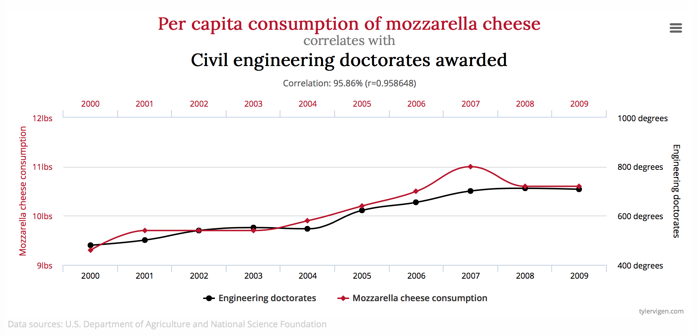

# Workshop!
---

We will be re-creating this chart from [Spurious Correlations](http://www.tylervigen.com/spurious-correlations):



### How to Get Started

1. Download "starter.html" and "cheese_engineers.csv" and save it in a folder
2. Use Terminal (Mac) or Command Prompt (PC), which both represent the command line, and you'll want to go to the folder you added the files to.
	* For both Macs and PCs, you'll use the ```cd``` command 
3. Once there, start a local server 
	* For Macs, you can simply run: ``` python -m http.server 8000 ``` if using python 3; ``` python -m SimpleHTTPServer 8000``` if using python 2
	* For PCs, it's a bit more complicated. You'll need to either download python or XAMPP. You can checkout [this page](https://www.apachefriends.org/index.html)
4. Go to your browser (Chrome is recommended), and go to this URL ```localhost:8000```

#### Note on local servers: 

In some cases, you can view local HTML files directly in your web browser. However, some browsers have restrictions that prevent them from loading local files via JavaScript, for security reasons. That means if your D3 code is trying to pull in any external datafiles (like CSVs or JSON), it will fail with no good explanation. This isn’t D3’s fault; it’s a browser feature that prevents loading of scripts and other external files from third-party, untrusted websites.

For this reason, it is much more reliable to load your page via a web server. Although you could use a remote web server, it is much, much faster to store and host everything locally (meaning, on the same computer, the one right in front of you). It is a strange idea, to use your local computer to host and serve files to itself, but you can think about it as the different programs talking to each other: the browser program requests files from the server program, which responds by serving them back.

### Helpful Links:
 * [Margin Conventions](https://bl.ocks.org/mbostock/3019563)
 * [Data Joins](https://bost.ocks.org/mike/join/)
 * [Chaining Syntax](http://alignedleft.com/tutorials/d3/chaining-methods)
 * [How Selections Work](https://bost.ocks.org/mike/selection/)
 * [D3 Scales](https://github.com/d3/d3/blob/master/API.md#scales-d3-scale)
 * [D3 Axes](https://github.com/d3/d3-axis)
 * [Scatterplot example](https://bl.ocks.org/mbostock/3887118)
 * [D3 Path](https://github.com/d3/d3-path)
 * More on [D3 Path](https://www.dashingd3js.com/svg-paths-and-d3js)
 
### Finished Product:
In the event that you get lost during the workshop, you can downlowd the "finished product" that we will create in this class (called finished_chart.html). I would recommend, however, that you do your best to not look at the finished product, and instead try to follow along during the workshop as we go.

We will not be adding any user interaction into the class today as there just isn't time for this in an intro workshop. I went ahead and threw in some quick interactions, though, and posted it to [this bl.ocks](https://bl.ocks.org/molliemarie/815014f9028b494728d5e161ee01cffb) so you can see how some simple interactions might be added.
